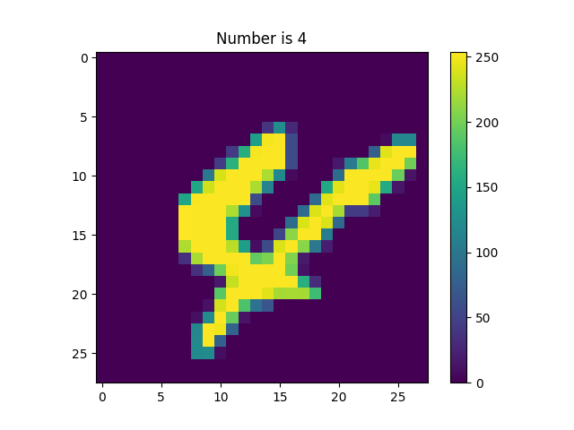
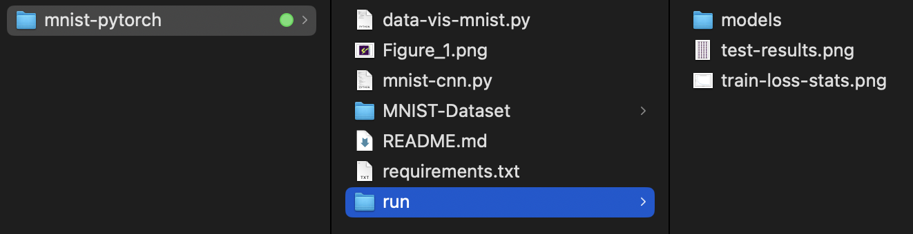

# MNIST-PyTorch

---

This project implements a simple Feed Forward Convolutional Neural Network (CNN) with three fully connected layers and ReLU activation functions between them. Implementation using PyTorch to recognize handwritten digits from the [MNIST dataset](https://pypi.org/project/mnist/#files). 

The input images are 28x28 pixels. The output is a 10-dimensional vector representing the scores for each digit class.

---

### Contents

[**0. Getting started**](##0.Getting-started)


[**1. Visualize the data**](##1.Visualize-the-data)

[**2. Train and Evaluate the Model**](https://www.notion.so/MNIST-PyTorch-bef9d4f922ad46d6a02529cf1363db8d?pvs=21)

[**3. Folder Structure**](https://www.notion.so/MNIST-PyTorch-bef9d4f922ad46d6a02529cf1363db8d?pvs=21)

[**4. Neural Network Breakdown**](https://www.notion.so/MNIST-PyTorch-bef9d4f922ad46d6a02529cf1363db8d?pvs=21)

[**5. Training loop breakdown**](https://www.notion.so/MNIST-PyTorch-bef9d4f922ad46d6a02529cf1363db8d?pvs=21)

[**6. Saving the model**](https://www.notion.so/MNIST-PyTorch-bef9d4f922ad46d6a02529cf1363db8d?pvs=21)

---

##0.Getting started

1. `mnist-cnn.py`: This file contains the network class and codes to load the training and testing data to train and evaluate the model.

2. `data-vis-mnist.py`: This file is used to visualize the MNIST dataset. Running this script first is recommended to verify and visualize the data before training the model.

```
cd MNIST-PyTorch
pip install -r requirements.txt
```

##1.Visualize the data

To visualize the MNIST dataset, run the following command:

```
python3 data-vis-mnist.py
```

This script will display sample images from the MNIST dataset to help you verify that the data is loaded correctly.

```
+--------------+-------+
| Total Data   | 70000 |
+--------------+-------+
| Image size   | 28x28 |
+--------------+-------+
| Train Images | 60000 |
+--------------+-------+
| Train Labels | 60000 |
+--------------+-------+
| Test Images  | 10000 |
+--------------+-------+
| Test Labels  | 10000 |
+--------------+-------+
```



## **2. Train and Evaluate the Model**

To train and evaluate the CNN model, use the **`mnist-cnn.py`** script. It takes two optional arguments:

- **`-epoch`**: Number of epochs to train the model (default: 20)
- **`-learningRate`**: Learning rate for the optimizer (default: 0.01)

Example command to run the training and evaluation with custom arguments:

```bash
bashCopy code
python3 mnist-cnn.py --epoch=50 --learningRate=0.001

```

The results of the training will be stored in the **`run`** folder of the project directory.


## 3. Folder Structure



## 4.  Neural Network Breakdown

```python
class MyMnistCNN(nn.Module):
    def __init__(self):
        super().__init__()
        self.Matrix1 = nn.Linear(28**2,100)
        self.Matrix2 = nn.Linear(100,50)
        self.Matrix3 = nn.Linear(50,10)
        self.R = nn.ReLU()
    def forward(self,x):
        x = x.view(-1,28**2)
        x = self.R(self.Matrix1(x))
        x = self.R(self.Matrix2(x))
        x = self.Matrix3(x)
        return x.squeeze();
```

The network inherits from torch.nn.Module which is a base class for all neural network modules in PyTorch.

**Initialization** 

1. **Layers**:
    - **`self.Matrix1 = nn.Linear(28**2, 100)`**: This is a fully connected layer (linear transformation) that takes an input of size 28×28=784 (flattened image of 28x28 pixels) and maps it to a 100-dimensional output.
        
        28×28=784
        
    - **`self.Matrix2 = nn.Linear(100, 50)`**: This layer takes the 100-dimensional output from the previous layer and maps it to a 50-dimensional output.
    - **`self.Matrix3 = nn.Linear(50, 10)`**: This final layer maps the 50-dimensional output to a 10-dimensional output, corresponding to the 10 classes of the MNIST digits (0 through 9).
2. **Activation Function**:
    - **`self.R = nn.ReLU()`**: The ReLU (Rectified Linear Unit) activation function is used to introduce non-linearity into the model.

**Forward Pass**

1. **Input Reshaping**:
    - **`x = x.view(-1, 28**2)`**: The input **`x`** is reshaped into a 2D tensor with size (−1,784). The **`1`** means the size of that dimension is inferred from the other dimensions (usually representing the batch size). This flattens the 28x28 pixel image into a 784-dimensional vector.
        
        (−1,784)
        
2. **Layer 1**:
    - **`x = self.R(self.Matrix1(x))`**: The input is passed through the first linear layer (**`Matrix1`**) and then the ReLU activation function.
3. **Layer 2**:
    - **`x = self.R(self.Matrix2(x))`**: The output from the first layer is passed through the second linear layer (**`Matrix2`**) and then the ReLU activation function.
4. **Layer 3**:
    - **`x = self.Matrix3(x)`**: The output from the second layer is passed through the third linear layer (**`Matrix3`**). Note that no activation function is applied after this layer, as it's the final output layer and the raw scores (logits) for each of the 10 classes are typically used directly in classification tasks.
5. **Output**:
    - **`return x.squeeze()`**: The **`squeeze()`** function removes any singleton dimensions (dimensions with size 1) from the tensor. This is often used to ensure the output is the correct shape.

## 5. Training loop breakdown

```python

# Training Loop
def train_model(dl, f, n_epochs=20, lr=0.01):
    # Optimization
    opt = SGD(f.parameters(), lr)
    L = nn.CrossEntropyLoss()

    # Train model
    losses = []
    epochs = []
    for epoch in range(n_epochs):
        N = len(dl)
        for i, (x, y) in enumerate(dl):
            # Update the weights of the network
            if device == "mps":
                y = y.type(torch.float32)
                y.to(device)
                x.to(device)
                x = x.type(torch.float32)
            elif device == "cuda":
                y.to(device)
                x.to(device)
            opt.zero_grad()
            loss_value = L(f(x), y) 
            loss_value.backward() 
            opt.step() 
            # Store training data
            epochs.append(epoch+i/N)
            losses.append(loss_value.item())
        print(f'Epoch {epoch}: Loss: {loss_value}')
    return np.array(epochs), np.array(losses);
```

The function **`train_model`** trains your neural network on a dataset provided by a data loader (**`dl`**). It does this over a specified number of epochs (repeated passes through the dataset) and uses an optimization algorithm to adjust the network's weights to minimize the loss.

```python
def train_model(dl, f, n_epochs=20, lr=0.01):
    # Optimization
    opt = SGD(f.parameters(), lr)
    L = nn.CrossEntropyLoss()
```

1. **Optimizer**: **`opt = SGD(f.parameters(), lr)`** sets up the Stochastic Gradient Descent (SGD) optimizer to adjust the network's weights, with a learning rate (**`lr`**) that controls how big the adjustments are.
2. **Loss Function**: **`L = nn.CrossEntropyLoss()`** defines the loss function that measures how well the network's predictions match the true labels. I have used Cross-Entropy Loss which is  common for classification tasks.

### **Variables to Track Progress**

```python
    # Train model
    losses = []
    epochs = []
```

These lists (**`losses`** and **`epochs`**) will store the loss values and the epoch numbers for each training step to keep track of the training progress. Later used to plot the training results and loss summerization.

### **Main Training Loop**

```python
    for epoch in range(n_epochs):
        N = len(dl)
        for i, (x, y) in enumerate(dl):
```

The outer loop runs for a set number of epochs (**`n_epochs`**), and the inner loop goes through each batch of data in the data loader (**`dl`**).

- **`N = len(dl)`** calculates the number of batches in the data loader.
- **`for i, (x, y) in enumerate(dl)`** iterates over the data loader, providing one batch of data (**`x`**, inputs) and labels (**`y`**, targets) at a time.

### **Preparing Data for Device**

```python
            if device == "mps":
                y = y.type(torch.float32)
                y.to(device)
                x.to(device)
                x = x.type(torch.float32)
            elif device == "cuda":
                y.to(device)
                x.to(device)
```

This section ensures the data is moved to the appropriate device (either an MPS device or CUDA for GPU processing). It also converts the data to the correct type if needed.

### **Training Steps**

```python
            opt.zero_grad()
            loss_value = L(f(x), y)
            loss_value.backward()
            opt.step()
```

1. **Zero Gradients**: **`opt.zero_grad()`** clears any previous gradients to prepare for the next update.
2. **Compute Loss**: **`loss_value = L(f(x), y)`** computes the loss by passing the inputs (**`x`**) through the network (**`f`**) to get predictions and comparing them to the true labels (**`y`**).
3. **Backpropagation**: **`loss_value.backward()`** calculates the gradients of the loss with respect to the network's weights.
4. **Update Weights**: **`opt.step()`** updates the network's weights using the gradients.

### **Storing Progress**

```python
      			epochs.append(epoch+i/N)
            losses.append(loss_value.item())
```

This section records the current epoch and the loss value to track the training progress.

### **Print Progress**

```python
        print(f'Epoch {epoch}: Loss: {loss_value}')
    return np.array(epochs), np.array(losses)
```

## 6. Saving the model

```python
MODEL_PATH = Path(f'{runFolder}/models/')
MODEL_PATH.mkdir(parents=True, exist_ok=True)
MODEL_NAME = "mnist-cnn.pth"
MODEL_SAVE_PATH = MODEL_PATH / MODEL_NAME

torch.save(cnn.state_dict(), MODEL_SAVE_PATH)
```

### **Setting Up the Save Path**

```python
MODEL_PATH = Path(f'{runFolder}/models/')
MODEL_PATH.mkdir(parents=True, exist_ok=True)
```

1. **MODEL_PATH**: This line sets up the path where you want to save the model. It uses the **`Path`** class from the **`pathlib`** module to create a path string. **`runFolder`** is a variable that holds the root directory where you are saving your run's output, and **`/models/`** is a subdirectory within that root directory.
2. **mkdir(parents=True, exist_ok=True)**: This line creates the directory specified by **`MODEL_PATH`**.
    - **`parents=True`** ensures that any missing parent directories are also created.
    - **`exist_ok=True`** means that if the directory already exists, it will not raise an error.

### **Defining the Model File Name**

```python
MODEL_NAME = "mnist-cnn.pth"
MODEL_SAVE_PATH = MODEL_PATH / MODEL_NAME
```

1. **`MODEL_NAME`**: This is the name of the file where the model will be saved. The **`.pth`** extension is commonly used for PyTorch model files.
2. **`MODEL_SAVE_PATH`**: This combines **`MODEL_PATH`** and **`MODEL_NAME`** to create the full file path where the model will be saved.

### **Saving the Model state dict**

```python
torch.save(cnn.state_dict(), MODEL_SAVE_PATH)
```

1. **torch.save**: This is a PyTorch function used to save a serialized object to disk.
2. **`cnn.state_dict()`**: This method retrieves a dictionary containing the model's parameters (weights and biases). **`cnn`** is the instance of your model (an instance of **`MyMnistCNN`**).
3. **MODEL_SAVE_PATH**: This specifies the path to the file where the model's parameters will be saved.

---

Feel free to explore and modify the code as needed. Happy coding!
